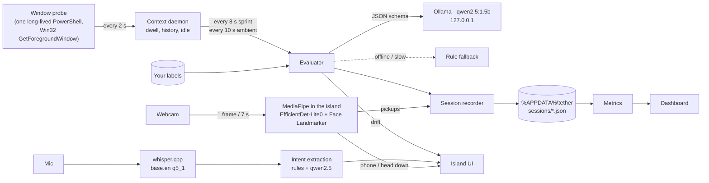

# Tether

**A Dynamic Island for your focus, run by a local AI.**

Tether is a small pill that sits at the top of your Windows screen. Say or type what you're working on and Tether starts a sprint. A 1.5B-parameter model running on your own machine then checks the window in front of you every few seconds. If you drift into YouTube, Reddit or Discord, the island turns amber and nudges you back to your goal. When the sprint ends you get a breakdown of where your attention actually went.

Tether works fully without a webcam. But site blockers have an obvious hole: you pick up your phone. So if you turn on the optional **Vision Sentinel**, Tether also glances at the webcam once every 7 seconds during a sprint. It checks that you're at your desk, whether a phone is in your hand, and whether your head has been pointed down at your lap. Phone time then counts as drift in every metric, and the dashboard gains a presence and gaze report.

All of this runs on your computer: the window watching, the webcam checks, the AI verdicts, speech-to-text and the analytics. Tether's AI never sends what you're doing to a server.

Built for the AppBuildersPH Hackathon 2026.

---

## Why does this benefit from running AI locally?

A focus copilot only works if it can see what you're doing, and "what you're doing" means your window titles. Window titles contain the name of the client you're emailing, the private repo you're in, the document you're drafting, the person you're chatting with and the video you're watching. Sending that stream to a cloud API every 8 seconds, all day, would be a hard thing to ask anyone to accept. Running locally changes four things:

1. **Privacy is the default, not a policy.** Window titles go to Ollama on `127.0.0.1:11434` and nowhere else. Webcam frames are analysed in memory inside the island and thrown away; no image is ever saved or sent. Your voice is written to a temp file, transcribed by whisper.cpp on your CPU, and deleted. Sessions are saved as JSON in `%APPDATA%\tether`, and you can delete them from the dashboard.
2. **It can afford to ask constantly.** A cloud model is priced per call. Tether can make up to 450 model calls in an hour-long sprint (one every 8 s), and locally that costs nothing. The model runs at `temperature: 0` with a JSON schema, so each verdict is a short, structured answer.
3. **It's fast enough to feel instant.** On a laptop RTX 4060, a verdict takes a median of **383 ms** (range 301–426 ms). A drift alert is never waiting on network round-trips.
4. **It works with the Wi-Fi off.** No account, no API key, no quota. The only thing that uses the internet is the "Google Calendar" button, which opens a pre-filled event in your own browser when you click it. The `.ics` export works offline.

## Features

**The island**
- **Sprints.** Type a goal and pick a length (15, 25, 45 or 60 minutes, or your own), or speak it. A countdown runs in the pill with a heartbeat dot.
- **Drift detection.** Every 8 s the foreground window is judged against your goal. Two confident "off-task" verdicts in a row (confidence ≥ 0.7) turn the island amber, show which app pulled you away, give a one-line nudge and play a soft two-note cue.
- **Voice goals.** Press `Ctrl+Shift+Space` (from any app) or the mic button and say, for example, *"Let's spend 30 minutes refactoring the Drizzle schema and fixing the migration."* whisper.cpp transcribes it and the local model turns it into **"Refactor Drizzle schema & fix migration · 30 min · Database"**. The sprint starts after a 3-second countdown unless you touch it. Durations ("an hour and a half", "twenty five minutes") are parsed by rules, not left to the model's arithmetic.
- **Vision Sentinel (optional).** Off by default. Turn it on with the **eye button** in the goal card, and Tether remembers the setting. Without it, no camera is used and nothing else changes. With it on, one 320×240 webcam frame every 7 s during a sprint goes through two on-device MediaPipe models: an object detector (looking for a *person* and a *cell phone*) and a face landmarker (giving head pitch and yaw). The pill shows a small badge: `LOCKED` (at the desk, facing the screen), `DOWN`, `ASIDE`, `NO FACE`, `AWAY` or `NO CAM`.
  - **Phone in frame** turns the island amber: *Physical drift · Smartphone detected · Return attention to sprint.* It clears when the phone goes down.
  - **Head down for two samples in a row (~14 s)** raises the same card as *"Head down: phone in your lap?"*. This catches the phone under the desk that the camera can't see.
  - **Looking to the side** only changes the badge. Glancing at a second monitor isn't drift.
  - **Phone time is drift, everywhere.** Each pickup is cut out of whatever window was in front and counted as drift. It lowers focus time, deep work and the flow score, turns its minutes amber on the timeline, shows up as **Smartphone** on the leak leaderboard, and is listed in **Friction debt** as *Physical drift · phone*. A browser blocker can't see any of this.
  - **Live preview** (`Ctrl+Alt+V`): a small window with the camera feed and what the models see drawn over it (boxes with scores, face points, head angles, inference time). It runs at ~5 fps only while it's open.
- **Ambient Mode.** No goal, no timer and no pop-ups. Tether checks the window every 10 s against "general productive work", sorts activity into groups (Coding, Research / Docs, Messaging / Social, Video / Entertainment…) in 15-minute buckets, and quietly logs drift to the dashboard.
- **Resume Flow.** After five or more minutes off-task or away, a "Welcome back" card rebuilds where you were from the last 15 minutes: the active file, the last terminal command, the docs you had open. It includes a one-line note from the local model and a copyable resume prompt.
- **Sprint summary.** Deep-flow time, drift time, flow score, fragmentation index and a minute-by-minute ribbon. Export to Google Calendar or as an `.ics` file.

**The dashboard** (the grid icon on the island)
- **Attention residue timeline.** Every minute of today's sprints, coloured by state (focus, debugging, drift, away).
- **Activity stream.** Every window, with the verdict and the reason behind it. **Click a state to relabel a site** as *always on-task* or *always drift*. Your labels override the model from then on and re-score past sprints.
- **Cognitive leak leaderboard.** The apps and sites holding your off-task attention.
- **Friction debt.** Rabbit holes ranked by how deep they went before you came back, including phone pickups from the Vision Sentinel.
- **Ambient activity.** The 15-minute buckets from Ambient Mode.
- **Vision Sentinel.** With the webcam on: time at the desk, eyes on screen (and how much was down or aside), phone pickups with time on the phone, and head-down spells. With it off, the card says so, because the rest of the dashboard doesn't need it.
- **Sprints.** Every sprint with its scores and calendar export.
- **Demo day.** A generated day of sprints, so every chart can be explored without recording one first.

### How the metrics are computed

All metrics are pure functions in [`electron/analytics/metrics.cjs`](electron/analytics/metrics.cjs) and are unit-tested.

| Metric | Definition |
|---|---|
| **Deep flow** | On-task stretches of 5 min or more. One short peek (< 30 s) doesn't break a stretch. A longer drift, a second peek within 2 min, or 2 min away does. |
| **Fragmentation index (CFI)** | Per 15-minute window, 100 minus penalties: 1 per switch inside the same domain, 8 per switch to a different domain, and 12 per on-task ↔ off-task flip within 90 s. Normalised to active time. |
| **Flow score** | The average of on-task share (%) and the time-weighted CFI. |
| **Debugging** | On-task time where the editor or terminal title shows errors. It is counted as work, not drift. |
| **Phone time** (Vision Sentinel) | From when a phone appears in frame, or the head has been down for 2 samples in a row, until it's gone. It replaces the window in front for that span and counts as drift. Every pickup is listed, with no 30 s minimum. |
| **At the desk / eyes on screen** | Share of webcam samples with a person in frame; of those, the share facing the screen rather than down or aside. |

## How it works



- **Electron** main process (CommonJS) with a sandboxed preload. **React 19**, **Tailwind v4** and **Framer Motion** for the island and the dashboard, built with **Vite**.
- **Window probe.** A single PowerShell process stays alive and answers JSON over stdin/stdout, so a sample costs a few milliseconds instead of about 1 s per spawn. From your screen, Tether reads the **foreground window title and process name only**. No screenshots, no keystrokes, no page contents.
- **Model calls.** `qwen2.5:1.5b` through Ollama's `/api/generate` with a strict JSON schema (`format`), `temperature: 0`, a 2048-token context and `keep_alive: 30m`. The prompt asks *"is this related to the goal?"* rather than *"is this a distraction?"*, because small models lean towards "yes" on accusatory questions. The reason is generated before the verdict.
- **Never stuck.** If Ollama is offline, slow or returns something unusable, a deterministic rule set takes over with the same output shape. Editors, terminals and idle time are decided by rules without calling the model.
- **Voice.** The mic is captured in the renderer, downsampled to 16 kHz and sent over IPC. The main process runs whisper.cpp's `whisper-cli` with `ggml-base.en-q5_1` (60 MB) and a prompt listing developer terms, so "Claude Code" isn't heard as "cloud code". The mic permission is granted only to Tether's own windows.
- **Vision.** `@mediapipe/tasks-vision` runs as WebAssembly on the CPU in the island's renderer; there are no native builds and no Python. The camera is opened when a sprint starts and released when it ends. Head pose comes from the face landmarks' depth (forehead vs chin, cheek vs cheek) and is compared with your own usual "looking at the screen" pose, which Tether learns as you work, because a webcam above the screen never sees you straight on. The camera permission, like the mic's, is granted only to Tether's own windows.

## Measured performance

Measured on an Intel i5-12450H, laptop RTX 4060, 16 GB RAM, Windows 11, Ollama 0.40.2.

| What | Result | How to reproduce |
|---|---|---|
| Drift verdict latency (model) | median **383 ms**, 301–426 ms | `npm run eval` |
| Drift verdict accuracy | **10/10** on the built-in fixture: 5 distractions and 5 work windows, including Stack Overflow and auth docs that must *not* be flagged | `npm run eval` |
| Speech-to-text (whisper.cpp, CPU) | **0.6–1.2 s** for a 4–5 s sentence, about 1.7 s on the first, cold run | voice input |
| Goal extraction from a transcript | about **200 ms** warm | voice input |
| Vision Sentinel models, load | about **0.3–0.6 s** | first sprint start |
| Vision Sentinel, one 320×240 frame (detector + face landmarker, CPU) | **100–175 ms** | inference time in the `Ctrl+Alt+V` preview |
| Unit tests | **45/45** pass | `npm test` |

The eval fixture is small and hand-written. It checks that the prompt and schema behave, but it is not a benchmark. Two of its ten cases (editor and terminal) are decided by rules, not the model.

## Getting started

**Requirements:** Windows 10 or 11, Node.js 22+, and [Ollama](https://ollama.com/download).

```powershell
git clone https://github.com/Nathan-Dow/Tether.git
cd Tether
npm install

ollama pull qwen2.5:1.5b   # ~1 GB, one time
npm run setup:voice        # whisper.cpp + base.en model (~60 MB), one time, optional
npm run setup:vision       # MediaPipe runtime + detector and face models (~8 MB), one time, optional

npm start                  # starts Vite and the island
```

Stop it with `Ctrl+C` in that terminal. Without Ollama running, Tether still works on its rule fallback. Without `setup:voice`, the mic button explains what's missing. Without `setup:vision` or a webcam, the badge reads `NO CAM` and everything else works as normal.

### Commands

| Command | What it does |
|---|---|
| `npm start` | Run Tether (Vite dev server + Electron) |
| `npm run preview:prod` | Build and run the production bundle |
| `npm test` | Unit tests (analytics, calendar, labels, resume, voice, ambient, vision) |
| `npm run eval` | Model accuracy and latency on the drift fixture |
| `npm run probe` | Print what the window probe sees, live |
| `npm run setup:voice` | Download whisper.cpp and the speech model into `vendor/` |
| `npm run setup:vision` | Copy the MediaPipe runtime and download the vision models into `public/vision/` |

### Shortcuts

| Keys | Where | Action |
|---|---|---|
| `Ctrl+Shift+K` | anywhere | Open the goal card |
| `Ctrl+Shift+Space` | anywhere | Speak a goal (pause, or press again, to finish) |
| `Ctrl+Alt+V` | anywhere | Open / close the Vision Sentinel live preview |
| `Ctrl+Shift+W` | anywhere | Demo: toggle "Smartphone detected" (works with no camera) |
| `Ctrl+K` | island | Goal card: Sprint/Ambient toggle, mic, end, dashboard |
| `Esc` | island | Close or cancel |
| `Ctrl+Shift+D` / `S` / `R` | island | Demo drift alert / summary card / welcome-back card |
| Drag / double-click the grip | island | Move / re-centre the island |

### Settings (environment variables)

| Variable | Default | |
|---|---|---|
| `TETHER_MODEL` | `qwen2.5:1.5b` | Any Ollama model |
| `OLLAMA_URL` | `http://127.0.0.1:11434` | |
| `TETHER_EVAL_MS` | `8000` | Sprint verdict interval |
| `TETHER_RESUME_MIN` | `5` | Minutes away before Resume Flow |
| `TETHER_WHISPER_DIR` | `vendor/whisper` | Where whisper.cpp lives |

## Your data

| Data | Where | Leaves the machine? |
|---|---|---|
| Window titles and verdicts | `%APPDATA%\tether\sessions\*.json` | No |
| Site labels | `%APPDATA%\tether\labels.json` | No |
| Voice recordings | Temp WAV, deleted right after transcription | No |
| Webcam frames | Memory only, replaced every 7 s; never written to disk | No |
| Webcam check results and phone pickups | In the sprint's session file: one *present / gaze* reading per 7 s, plus pickup start and end times (only with the Vision Sentinel on) | No |
| Calendar event | Your browser, only when you click "Google Calendar" | Yes, the summary you chose to export |

**Clear history** on the dashboard deletes every recorded sprint.

## Limitations

- **Windows only.** The window probe uses Win32 APIs. macOS and Linux probes are not written.
- **Titles, not content.** Tether judges what a window is called, not what's on it. A YouTube tab titled "Rust ownership explained" will usually, and correctly, read as research. A vague title like "New Tab" carries no signal.
- **English voice input.** `base.en` is an English-only model.
- **A small model makes small-model mistakes.** That's why there are labels: one click tells Tether that a site is always work, or always not.
- **The Vision Sentinel is a first version.** Its thresholds (phone score 0.35, head down 18° past your usual pose) are starting points and haven't been tested across many people, cameras or lighting. EfficientDet-Lite0 is small, so a phone held edge-on or mostly covered by a hand can be missed. Use the `Ctrl+Alt+V` preview to see what it sees.
- **The camera light stays on during a sprint** with the Vision Sentinel on, because the camera stays open between samples.
- **`Ctrl+Shift+W` is taken while Tether runs**, so it won't close Chrome windows.

## Project layout

```
electron/
  main.cjs            windows, IPC, shortcuts, permissions
  context/            window probe, classifier, context daemon
  ai/                 Ollama client, evaluator, rule fallback
  analytics/          recorder, store, metrics, groups, labels, resume, calendar, demo day
  voice/              whisper.cpp runner, intent extraction
src/
  components/         island cards (goal, drift, voice, summary, resume)
  hooks/              countdown, voice capture, Vision Sentinel sampler
  lib/vision.js       MediaPipe models, head pose, gaze tracking
  vision/             Vision Sentinel live preview window
  dashboard/          dashboard window
scripts/              eval, probe, setup-voice, setup-vision
test/                 node:test suites
```
